# Git y GitHUB
## Git
### ¿Que es?
Es un sistema de control de versiones distribuido. Distribuido quiere decir que no depende de un unico sitio. Podemos llegar a tener una copia del codigo en distintos equipos
> Sistema de control de versiones: Permite llevar un historial de los cambios del proyecto (documenta y traza los cambios)

### Instalacion

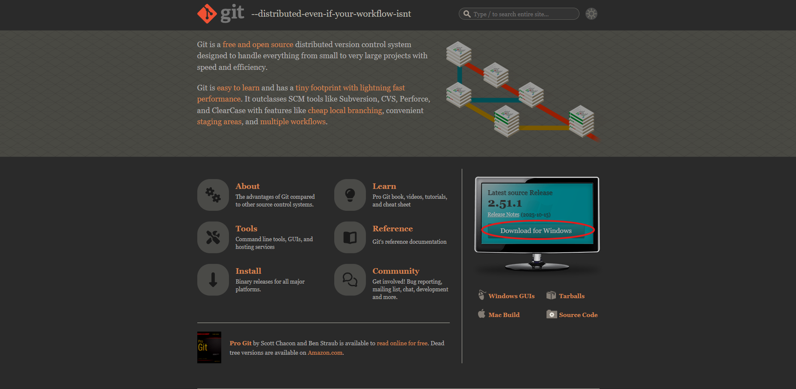
1. Entramos a la pagina oficial de Git https://git-scm.com
2. Damos click en Install o Download for Windows (como se ve señalado en la imagen)

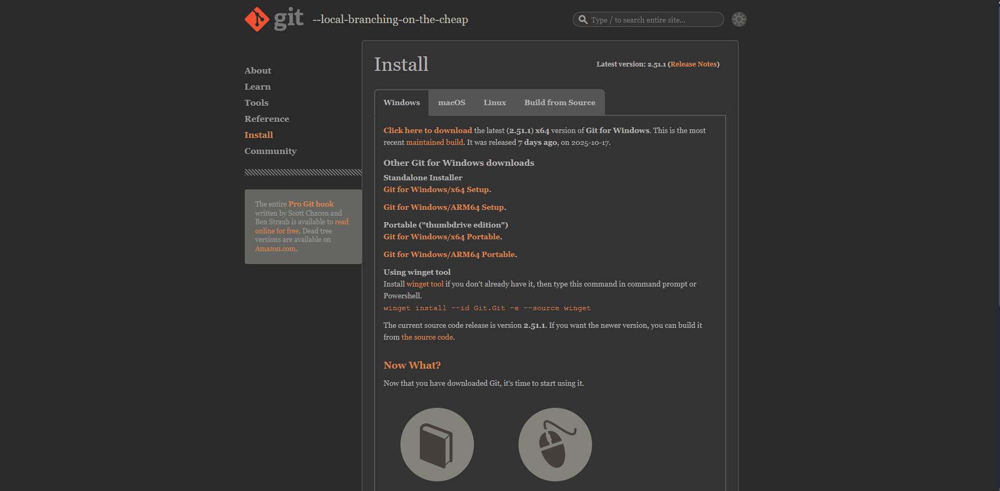

3. Seleccionamos nuestro sistema operativo (En mi caso es Windows de 64 bits)
4. Seguimos el paso a paso de una descarga habitual
5. Damos "Next" 

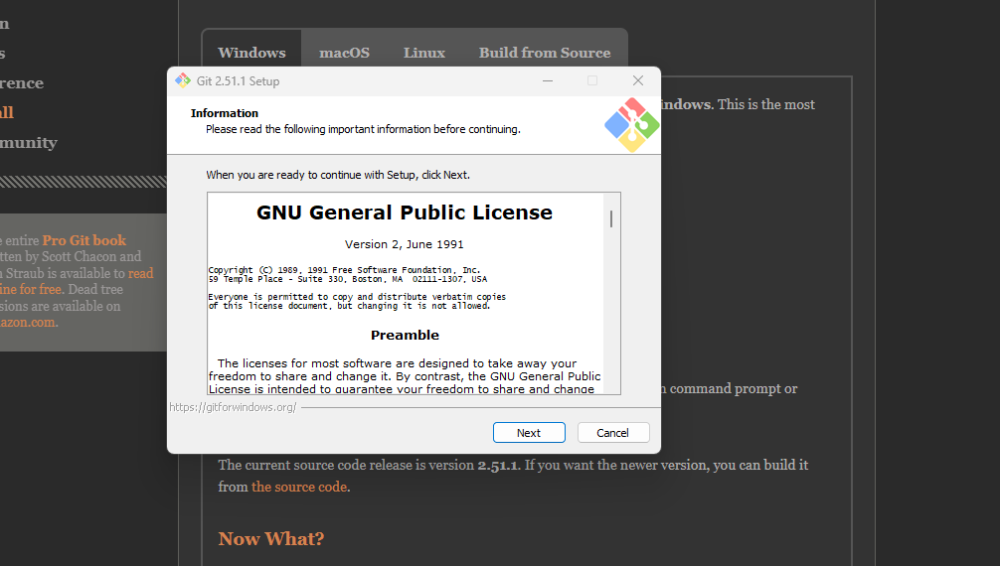

6. Seleccionamos la ubicacion de destio

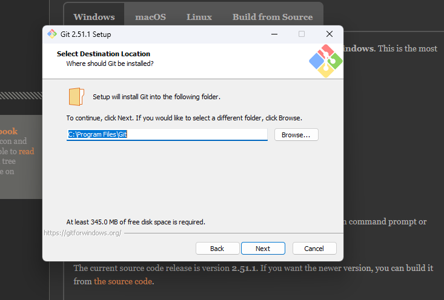

7. Nos va a preguntar que queremos instalar

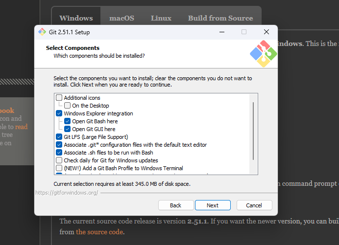

8. A continuacion solo le di Next.. Next.. hasta q me dijo Install
9. Una vez instalado podemos comprobarlo con el comando 
```
Git --version
```
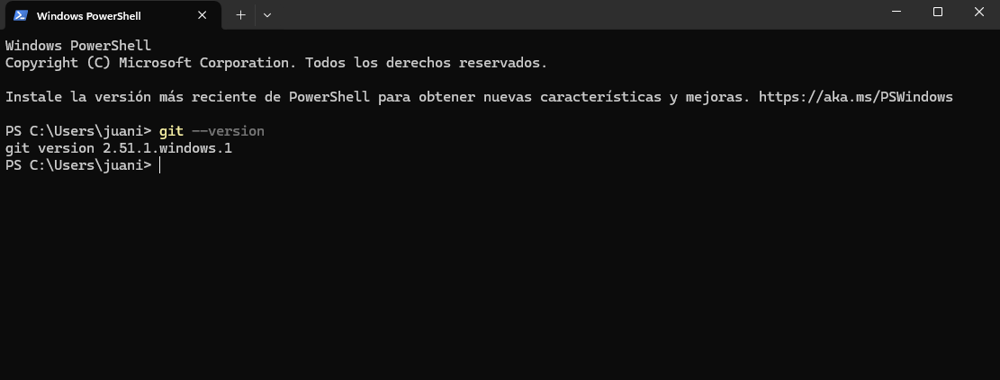


### Comandos de terminal


* ``` ls ```: Este comando nos va a mostrar un listado de todos los directorios

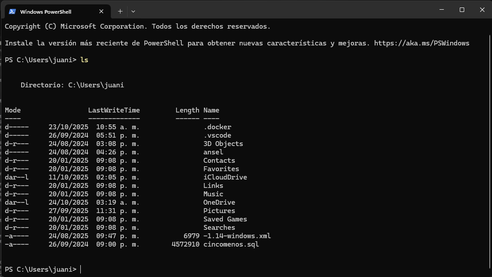

* ``` cd .\Ubicacion\ ```: Este comando permite cambiarnos de carpeta o de ubicacion

* ``` cd .. ```: Podemos devolvernos a la ubicacion anterior

* ``` pwd ```: Va a mostrar nuestra ubicacion

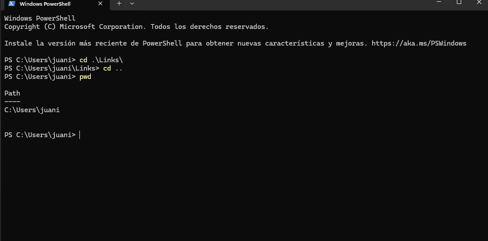

* ``` mkdir "NombreCarpeta ```: Crea una carpeta en nuestra ubicacion

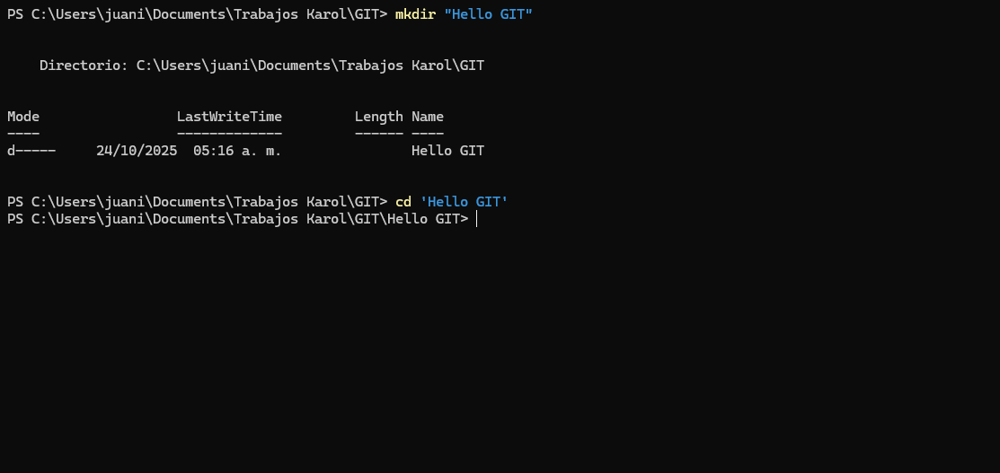

* ``` code . ```: Con ese comando podemos ingresar a Visual Studio Code


### Configuracion de Git
>Lo minimo para configurar Git es tener nombre de Usuario y tener un Email
* Para tocar la configuracion de Git es necesario  ```git config  ```
* Debemos establecer a que nivel vamos a establecer la configuracion  ```  --global ```
* Para configurar el usuario pondremos  ```user.name "NombreUser" ```
* Otra propiedad q podemos configurar es el Email con  ```user.email "email@x.com" ```

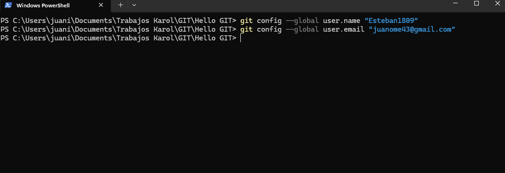

### Comandos de Git 
* Para indicarle a Git q trabaje en algun directorio
> * Ubicamos el directorio donde queremos inicializar Git
> * Escribimos ```git init ```  
> **Veremos que se ha creado una carpeta  ```.git ``` lo cual indica que se ha creado un repositorio de Git**

 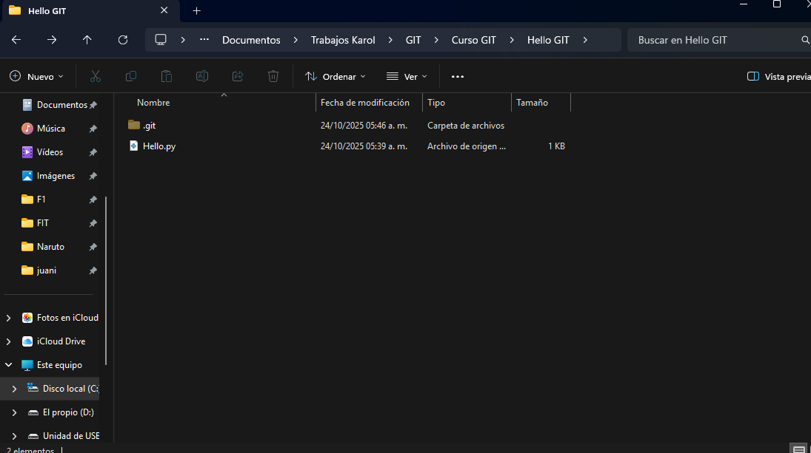

#### Ramas en Git
La rama principal o inicialmente creada, sera la master; sin embargo, esta puede ser main. Para este se maneja el  ```git branch -m ``` seguido del nombre que le queramos poner a la rama
> **Con  ``` git status``` podemos ver lo q hay en la rama**
 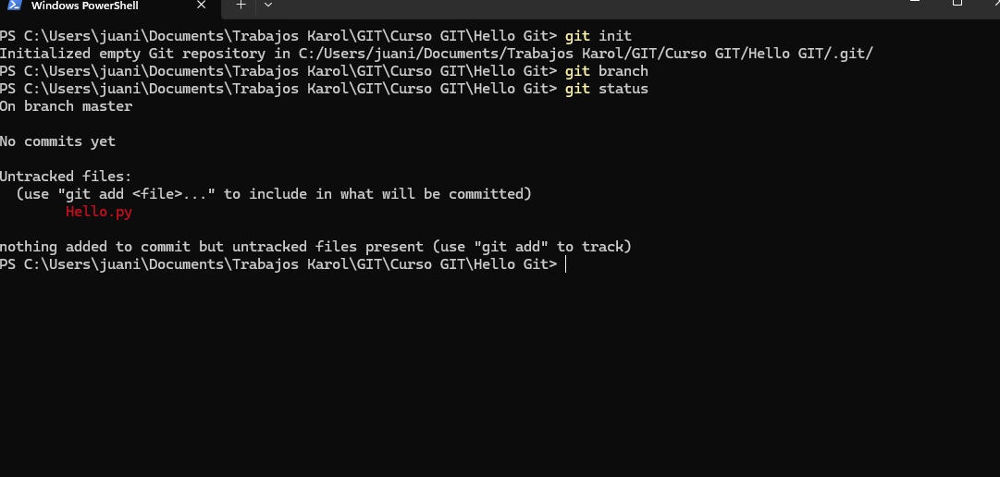


#### Añadir lo deseado al repositorio
Para añadir algo al repositorio, se usa el comando  ```git add ``` junto a lo que se desee añadir q en este caso seria  ``` git add Hello.py```
> Si queremos añadir todo lo de la ubicacion que esta pendiente, basta con unas un  ``` .```  

Podemos confirmar que se ha añadido al repositorio con el  ```git status ```  de nuevo


#### Lanzar version
Hasta ahora todo lo q hemos hecho sigue estando en nuestra maquina local.
Para hacer esto, necesitamos el comando  ```commit ``` junto a un mensaje el cual definira la version. Esto se puede hacer de dos formas, una q no explicare pq es mas larga y compleja y otra q consiste en simplemente utilizar el comando  
 ```git commit -m "mensaje" ``` donde -m quiere decir mensaje.  
Podemos ver como se ha creado el commit con el mensaje "primero" en el cual a realizado una insercion creando el archivo q tenemos en python

> Podemos ver en la imagen que encerrado en un circulo rojo hay un hash. Un hash es como un identificador unico de la version

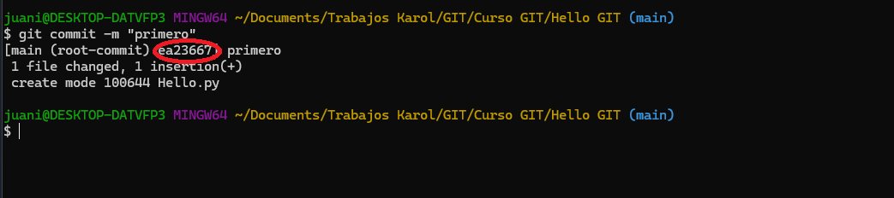

#### Logs
Para ver los logs o registros sencillamente usaremos el comando ```git log``` donde veremos algo asi: 


Si agregamos un nuevo commit o como nos dice en el video, otra foto, veremos esto tambien en los registros 

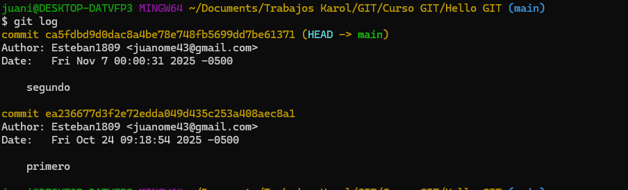

 Si queremos verlo un poco mas detallado como si fuera una rama usamos ```git log --graph```

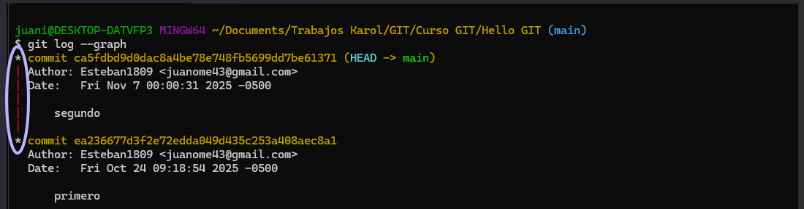

vemos como va paso a paso con los *


#### Checkout y Reset
Si hacemos un cambio pero no lo comiteamos 

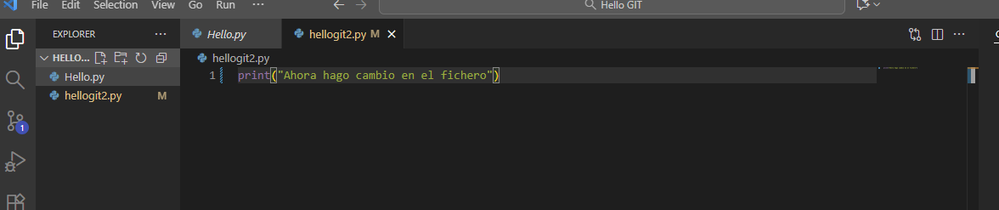

pero queremos que vuelva a estar como antes podemos usar  
 ```git checkout nombreArchivo``` 

 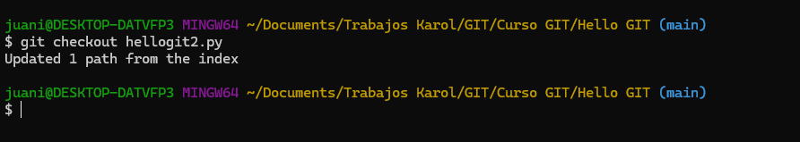

 Si queremos hacer una pequeña navegacion de los cambios que ha habido antes de guardar, podemos usar el ```git reset```


#### Alias 
Podemos usar los alias como atajos
Para crear uno tenemos que entrar a la configuracion de usuario la cual es con global, lo definimos y entre comillas le agregamos el comando que queremos que ejecute ese alias
```git config --global alias.nombre "comando git"```

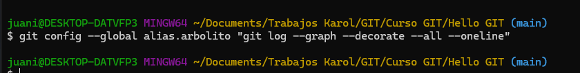

podemos confirmar que se ha creado yendo al fichero de configuracion donde teniamos el usuario y email

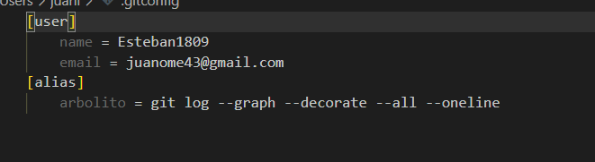

Ahora si escribo ```git arbolito``` me va a mostrar lo que dice el comando definido

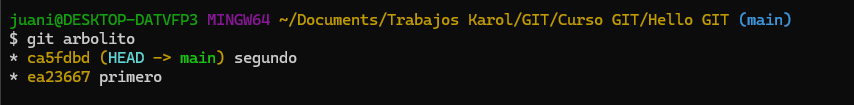


#### Ignore
Creando un archivo llamado ```.gitignore``` en la ubicacion del repositorio, podremos añadir los ficheros que no queremos añadir a ningun commit, asi cada que escribamos ```git status``` no nos saldra que debemos añadirlo

En el archivo tendremos que escribir ```**/.NombreFichero``` 


## Recomendaciones
* La documentacion nos va a servir de gran ayuda en caso de cualquier dudagit a